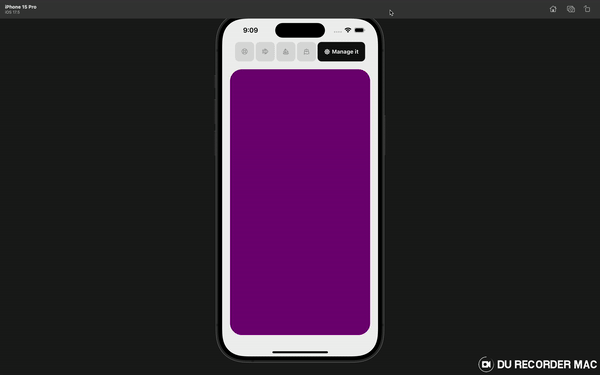

Here’s the final version of your `README.md` that includes the GIF from the project folder and mentions **Expo SDK 51**:

```markdown
# 🚀 Custom Animated Tabs in React Native



## ✨ Overview

This project showcases a **custom animated tab component** built using **Expo SDK 51**, featuring:

- 🎨 **React Native Reanimated** for smooth and performant animations.
- 🎉 **Moti** for simplified animation creation and sequencing.
- 🔥 **Lucide React Native** for beautifully crafted icons.

### 🌟 Features

- **Animated transitions** with smooth enter/exit animations.
- **Interactive tabs** that respond to user selection with stunning effects.
- **Lucide icons** for a clean, modern look.
- **Cross-platform compatibility** with both iOS and Android using **Expo SDK 51**.

## 🎬 Demo

Here's a GIF showcasing the custom animated tabs in action:


## 🛠️ Technologies Used

- **Expo SDK 51**: Fast and powerful development tools for React Native.
- **React Native Reanimated**: High-performance animations for React Native.
- **Moti**: Simplified animations in React Native.
- **Lucide React Native**: Customizable icons for a sleek UI.
- **TypeScript**: Ensures type safety and code maintainability.

## 🚀 Getting Started

Follow these steps to run the project locally:

### 1. Clone the Repository

```bash
git clone https://github.com/your-username/custom-animated-tabs.git
cd custom-animated-tabs
```

### 2. Install Dependencies

Use **yarn** or **npm** to install the required dependencies:

```bash
yarn install
# OR
npm install
```

### 3. Run the App

Run the app on iOS or Android using Expo:

```bash
expo start
```

### 🛠 Dependencies

Key libraries used in this project:

```json
{
  "expo": "^51.0.0",
  "react-native-reanimated": "^2.x.x",
  "moti": "^0.x.x",
  "lucide-react-native": "^0.x.x"
}
```

## ✨ Custom Tab Example

Below is a preview of the code for creating the custom animated tab component:

```tsx
import { Pressable, StyleSheet, Text, View } from 'react-native';
import React from 'react';
import { icons } from 'lucide-react-native';
import Animated from 'react-native-reanimated';

const Tabs = ({ data, selectedIndex, onChange }) => {
  return (
    <View style={{ flexDirection: 'row', gap: 4 }}>
      {data.map((item, index) => {
        const isSelected = selectedIndex === index;
        return (
          <Animated.View key={index} entering={...animation}>
            <Pressable onPress={() => onChange(index)}>
              <Icon name={item.icon} color={isSelected ? 'white' : 'grey'} />
              {isSelected && <Animated.Text> {item.label} </Animated.Text>}
            </Pressable>
          </Animated.View>
        );
      })}
    </View>
  );
};

export default Tabs;
```

## 🚀 Project Structure

- `components/`: Contains reusable components, including the **Tabs** component.
- `assets/`: Contains static assets like images and GIFs.

## 📂 Assets

Make sure the GIF (`demo.gif`) is located in the `assets` folder:

```
/assets
  └── demo.gif
```

---

Enjoy creating beautiful animations in your React Native apps with Expo! 🎉
```

In this template:

- The GIF of the demo (`demo.gif`) is expected to be in the `/assets` folder.
- The project setup and structure are clearly explained.
